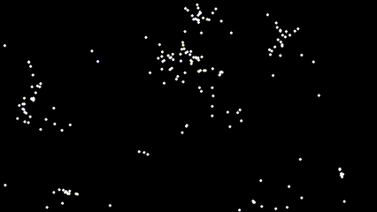
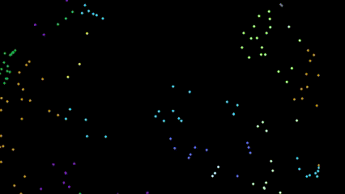
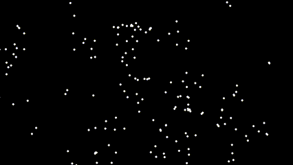

# 2D-Flocking-Simulation
Pygame Based Boid Flocking System

 &nbsp; &nbsp; &nbsp; &nbsp; 

# overview
Boids is an artificial life program, developed by Craig Reynolds, which simulates the flocking behaviour of birds, and related group motion. The name "boid" corresponds to a shortened version of "bird-oid object", which refers to a bird-like object
This project shows a simple flocking simulation in pygame.

To get this running on your machine, scroll down.

# Flocking
The complexity of Boids arises from the interaction of individual agents (the boids, in this case) adhering to a set of simple rules. The rules applied in the simplest Boids world are as follows:

1. separation: steer to avoid crowding local flockmates
2. alignment: steer towards the average heading of local flockmates
3. cohesion: steer to move towards the average position (center of mass) of local flockmates

`More complex rules can be added, such as obstacle avoidance and goal seeking.`

These rules can be represented as the following
## 1. Separation
The separation rule ensures that a boid steers to avoid crowding its local flockmates. Mathematically, this can be represented as:

$$\mathbf{F}_{\text{separation}} = -\sum_{i=1}^{N} \frac{\mathbf{p} - \mathbf{p}_i}{|\mathbf{p} - \mathbf{p}_i|}$$

where:
- $\mathbf{F}_{\text{separation}}$ is the separation force.
- $\mathbf{N}$ is the number of local flockmates.
- $\mathbf{p}$ is the position of the boid.
- $\mathbf{p}_i$ is the position of the \(i\)-th local flockmate.
- $|\mathbf{p} - \mathbf{p}_i|$ is the distance between the boid and the i-th local flockmate.

## 2. Alignment
The alignment rule ensures that a boid steers towards the average heading (velocity) of its local flockmates. Mathematically, this can be represented as:

$$\mathbf{F}_{\text{alignment}} = \frac{1}{N} \sum_{i=1}^{N} \mathbf{v}_i - \mathbf{v}$$

where:
- $\mathbf{F}_{\text{alignment}}$ is the alignment force.
- $\mathbf{N}$ is the number of local flockmates.
- $\mathbf{v}_i$ is the velocity of the i-th local flockmate.
- $\mathbf{v}$ is the velocity of the boid.

## 3. Cohesion
The cohesion rule ensures that a boid steers to move towards the average position (center of mass) of its local flockmates. Mathematically, this can be represented as:

$$\mathbf{F}_{\text{cohesion}} = \frac{1}{N} \sum_{i=1}^{N} \mathbf{p}_i - \mathbf{p}$$

where:
- $\mathbf{F}_{\text{cohesion}}$ is the cohesion force.
- $\mathbf{N}$ is the number of local flockmates.
- $\mathbf{p}_i$ is the position of the i-th local flockmate.
- $\mathbf{p}\$ is the position of the boid.

## Combining the Forces
In practice, the total steering force for a boid is often a weighted sum of the three forces:

$$\mathbf{F}_{\text{total}} = w_{\text{sep}} \mathbf{F}_{\text{separation}} + w_{\text{align}} \mathbf{F}_{\text{alignment}} + w_{\text{coh}} \mathbf{F}_{\text{cohesion}}$$

where:
- $w_{\text{sep}}$, $w_{\text{align}}$, and $w_{\text{coh}}$ are the weights for the separation, alignment, and cohesion forces, respectively.

These weights determine the relative importance of each rule in the boid's behavior.

## extra rules
Extra rules can be added to these to expand the behaviour of boids. For example:
1. Random noise added to individual boids to simulate aleatoric behaviour 
2. Repulsion force from predators
3. Hunting behaviour 
4. obstacle avoidance.

and many more

# Installation

### Prerequisites
- Python 3.x

1. Clone the repository
2. Navigate to the project directory

### Installing Required Libraries

This simulation uses Pygame for visualization and for vectorization. If you haven't installed Pygame yet, you can install them using pip. Open your terminal and run the following command:

```sh
pip install pygame
```

### Running the simulation

To run the simulation, run `main.py`
```sh
python main.py
```

# references 
`https://www.red3d.com/cwr/boids/`